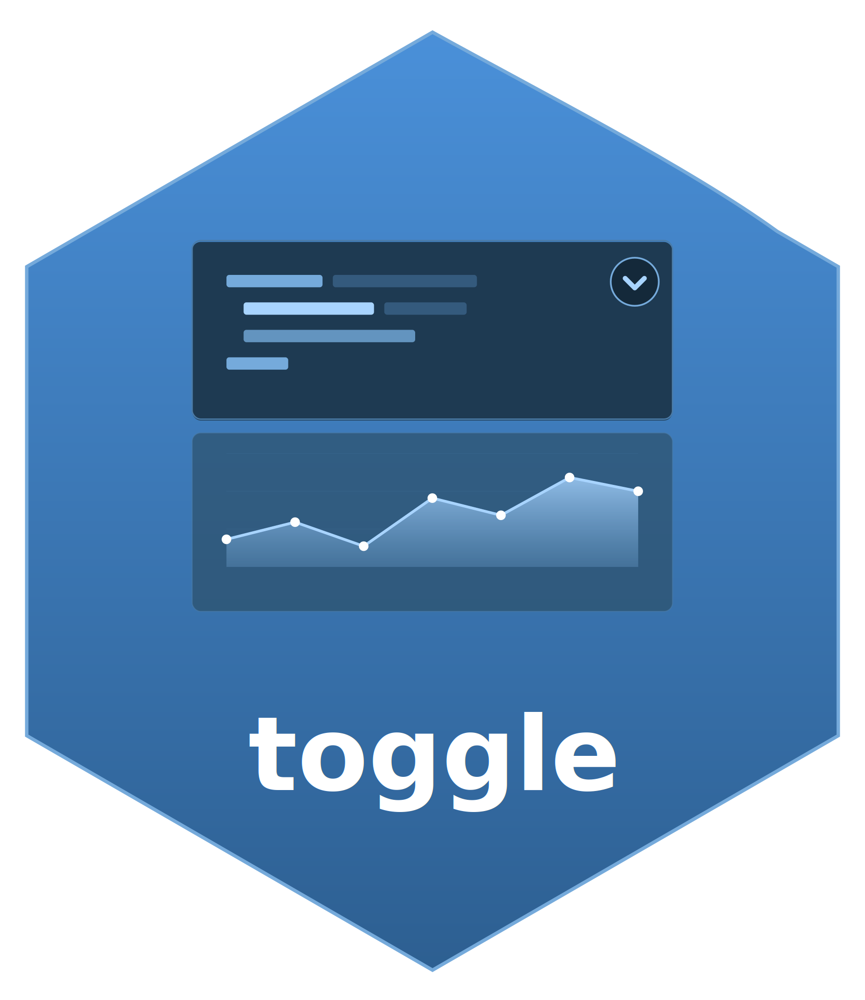

# toggle: Show/Hide Code Output 

The `toggle` extension allows you to toggle between showing code with output or just code by itself in Quarto HTML documents by adding a convenient toggle button that appears when hovering over code blocks, similar to the copy button.

## Installation

To install the `toggle` extension, follow these steps:

1. Open your terminal.

2. Execute the following command:

```bash
quarto add coatless-quarto/toggle
```

This command will download and install the extension under the `_extensions` subdirectory of your Quarto project. If you are using version control, ensure that you include this directory in your repository.

### Requirements

To use the `toggle` extension, ensure you have the following:

- Quarto >= 1.7.0

## Quick Start

1. **Add the filter** to your document's YAML header:

```yaml
---
title: "My Document"
format: html
filters:
  - toggle
---
```

2. **Enable toggle for specific code cells** by adding `toggle: true`:

````md
```{python}
#| toggle: true
print("Hello, Python world!")
```
````

That's it! A toggle button will now appear when you hover over the code block.


## Usage

At the top of your Quarto document, include the `filters` key with `toggle` specified in the YAML header:

```yaml
---
title: "My Document"
format: html
filters:
  - toggle
---
```

This will allow the toggle extension to be applied to your document.

### Cell-Level Configuration

To enable toggle functionality for a specific code cell, add the `toggle: true` attribute:

````md
```{r}
#| toggle: true
print("Hello, R world!")
```
````

#### Hide Output by Default

Start with output hidden using the `output-hidden` attribute:

````markdown
```{python}
#| toggle: true
#| output-hidden: true
import pandas as pd
print("This output is hidden by default")
```
````

#### Multi-Output Control

When code cells produce multiple outputs, you can control how the toggle buttons behave:

##### Individual Control (Default)

When `output-sync: false`, each output in a cell can be toggled independently. This is the default behavior.

````markdown
```{r}
#| toggle: true
#| output-sync: false
print("Output 1")  # Individual toggle
print("Output 2")  # Individual toggle
plot(cars)         # Individual toggle
```
````

##### Synchronized Control

When `output-sync: true`, all outputs for a cell are toggled together with a single button:

````markdown
```{r}
#| toggle: true
#| output-sync: true
print("Output 1")  # Any button controls all
print("Output 2")  # Any button controls all
plot(cars)         # Any button controls all
```
````


### Document-Level Configuration

You can enable toggle functionality for all code cells in your document by adding the following to your YAML header:

```yaml
---
title: "My Document"
format: html
extensions:
  toggle:
    output-toggle: true    # Enable toggle functionality
    output-hidden: false   # Show outputs initially (default)
    output-sync: false     # Individual control (default)
filters:
  - toggle
---
```

#### Configuration Options

| Option | Type | Default | Description |
|--------|------|---------|-------------|
| `output-toggle` | boolean | `false` | Enable toggle functionality |
| `output-hidden` | boolean | `false` | Hide outputs initially |
| `output-sync` | boolean | `false` | Synchronize all outputs in cell |
| `global-toggle` | boolean | `false` | Show a global toggle button to control all outputs |
| `persist` | boolean | `false` | Save toggle state in localStorage |
| `button-text` | string | `"Output"` | Custom text for the toggle button |

> [!IMPORTANT]
>
> To avoid confusion with the `toggle` document-level key, the document-level configuration uses `output-toggle` instead of `toggle` for enabling the toggle functionality globally.

#### Global Toggle Button

Add a floating button that controls all toggleable outputs on the page:

```yaml
extensions:
  toggle:
    output-toggle: true
    global-toggle: true
```

#### Persist Toggle State

Remember the user's toggle preferences across page reloads:

```yaml
extensions:
  toggle:
    output-toggle: true
    persist: true
```

#### Custom Button Text

Change the default "Output" label on toggle buttons:

```yaml
extensions:
  toggle:
    output-toggle: true
    button-text: "Result"
```

You can also customize per-cell:

````markdown
```{python}
#| toggle: true
#| button-text: "Answer"
print("The answer is 42")
```
````


#### Priority of Settings

- Cell-level settings override document-level settings
- If no cell-level setting is provided, document-level settings apply
- If neither is provided, toggle is not enabled for that cell

## Documentation

For more examples and detailed guides, visit the [documentation site](https://quarto.thecoatlessprofessor.com/toggle/).

## Help

To report a bug, please [add an issue](https://github.com/coatless-quarto/toggle/issues/new) to the repository's [bug tracker](https://github.com/coatless-quarto/toggle/issues).

Want to contribute a feature? Please open an issue ticket to discuss the feature before sending a pull request. 

