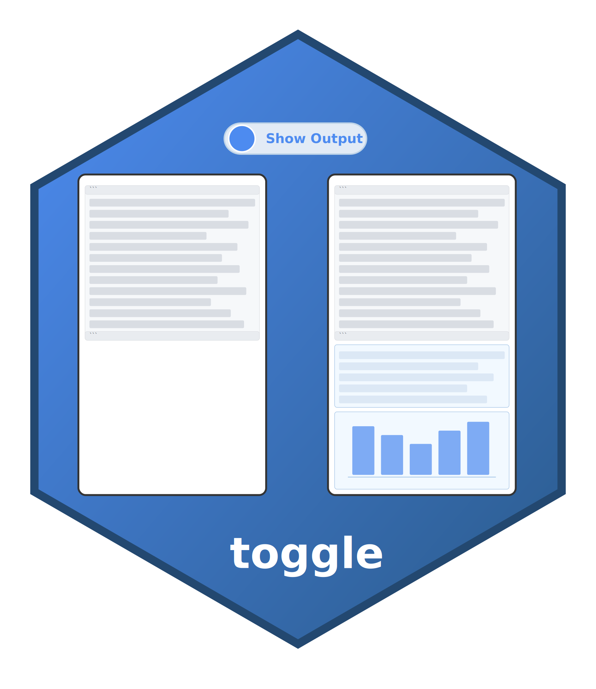

# toggle: Show/Hide Code Output 

The `toggle` extension allows you to toggle between showing code with output or just code by itself in Quarto HTML documents by adding a convenient toggle button that appears when hovering over code blocks, similar to the copy button.

> [!IMPORTANT]
> 
> GIF HERE
>

## Installation

To install the `toggle` shortcode extension, follow these steps:

1. Open your terminal.

2. Execute the following command:

```bash
quarto add coatless-quarto/toggle
```

This command will download and install the shortcode extension under the `_extensions` subdirectory of your Quarto project. If you are using version control, ensure that you include this directory in your repository.

## Usage

At the top of your Quarto document, include the `filters` key with `toggle` specified in the YAML header:

```yaml
---
title: "My Document"
format: html
filters:
  - toggle
---
```

This will allow the toggle extension to be applied to your document.

### Cell-Level Configuration

To enable toggle functionality for a specific code cell, add the `toggle: true` attribute:

````md
```{python}
#| toggle: true
print("Hello, Python world!")
```
````

You can also set whether the output is shown or hidden by default using the `output-hidden` attribute:

````md
```{r}
#| toggle: true
#| output-hidden: true
print("Hello, R world!")
```
````

This will hide the output by default, and the user can click the toggle button to show it.

### Document-Level Configuration

You can enable toggle functionality for all code cells in your document by adding the following to your YAML header:

```yaml
---
title: "My Document"
format: html
toggle:
  output-toggle: true    # Enable toggle buttons for all cells
  output-hidden: false   # Show outputs initially (default)
filters:
  - toggle
---
```

#### Priority of Settings

- Cell-level settings override document-level settings
- If no cell-level setting is provided, document-level settings apply
- If neither is provided, toggle is not enabled for that cell

## Help

To report a bug, please [add an issue](https://github.com/coatless-quarto/toggle/issues/new) to the repository's [bug tracker](https://github.com/coatless-quarto/toggle/issues).

Want to contribute a feature? Please open an issue ticket to discuss the feature before sending a pull request. 

